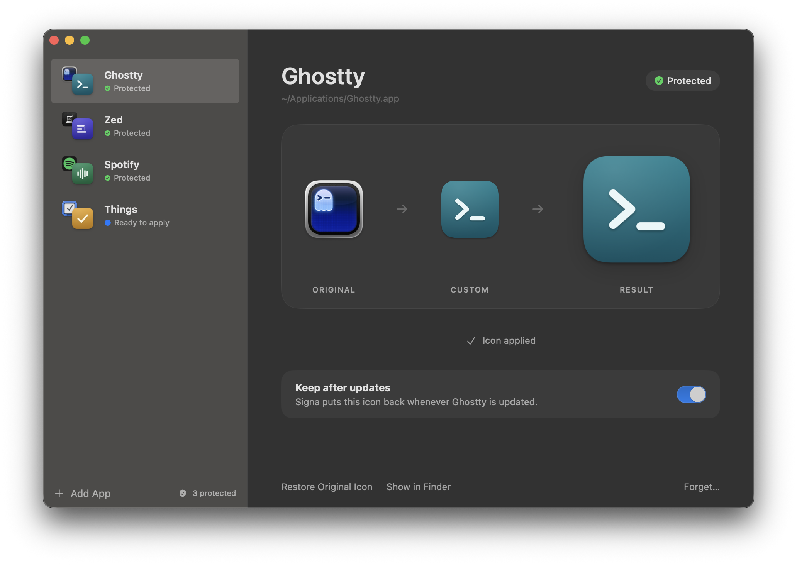

<p align="center">
  
</p>

# Signa

Custom app icons that stay.

You can give any Mac app your own icon, but the next update replaces the app
and your icon goes with it. Signa remembers the icon you chose and puts it back.



## Using it

1. Drag an app into the window.
2. Drop an image on it. Signa shows the app's current icon, your image, and the
   result, and turns the image into a proper Mac icon.
3. Press **Apply**.

**Keep after updates** is on by default. While it is on, Signa watches the app
and restores your icon whenever an update removes it. **Restore Original Icon**
gives the app its own icon back, and **Forget** stops managing the app and
leaves whatever icon it has.

Any image macOS can open will do: PNG, JPEG, WebP, TIFF, or a ready-made
`.icns` file. A square picture that fills its frame is given the rounded shape
of a Mac icon. Artwork that already has its own shape is kept as it is.

## What to expect

Signa works within what macOS allows, and says so when it cannot do something.

- **Permission.** macOS protects installed apps from being changed by other
  apps. Dragging an app into Signa is enough to change it that once. To put an
  icon back after an update, Signa needs **App Management** permission
  (System Settings → Privacy & Security → App Management). Without it the app
  is marked "Needs permission" and nothing is changed.
- **Apps installed for everyone.** Microsoft Office, Teams and apps from the
  App Store belong to the Mac's administrator. Signa asks for an administrator
  password when you apply an icon to one of them. After an update it never
  asks by itself: it marks the app "Needs your password" and waits for you.
- **The Dock.** If the app is running when you apply an icon, the Dock usually
  keeps showing the old one until the app is next launched. Finder shows the
  new icon straight away.
- **Apps that come with macOS.** Safari, Mail and the rest are sealed by the
  system and cannot have a custom icon.

## Download

There is no packaged download yet. Until there is, build it yourself.

## Build and run

Requires macOS 14 or later and the Swift 6 toolchain (Xcode or the Command Line
Tools). There are no other dependencies.

```sh
Scripts/build-app.sh        # builds build/Signa.app
open build/Signa.app
swift test                  # runs the test suite
```

The first build creates a self-signed certificate in `.signing/` (ignored by
git) and signs the app with it. macOS ties the permissions you grant to the
app's signature, so a stable signature keeps them from one build to the next.
Deleting `.signing/` gives the app a new identity, and you grant them again.

To distribute, sign with a Developer ID and notarize:

```sh
SIGNA_SIGNING_IDENTITY="Developer ID Application: …" Scripts/build-app.sh
```

For development, `SIGNA_DATA_DIRECTORY=/some/folder` makes Signa use a throwaway
library and leave the Mac's login items alone.

## How it works

- **The icon.** Signa sets a custom icon the way Finder's Get Info window does,
  through `NSWorkspace.setIcon(_:forFile:)`. macOS stores it as a hidden file
  at the top of the app bundle. Nothing inside `Contents/` is touched, so the
  app's code signature still verifies; only `codesign --strict` remarks on the
  extra file.
- **Noticing an update.** An update replaces the bundle, and the icon file with
  it. Signa asks macOS (FSEvents) to tell it when one of the kept apps changes.
  It does not poll. When a change arrives it waits for the app to be quiet for
  three seconds, compares the icon that is there with the one it applied, and
  restores it if they differ.
- **Running in the background.** While at least one app is kept, Signa
  registers itself as a login item (`SMAppService`) and stays running without
  a Dock icon after its window is closed. When no app is kept, it removes the
  login item again.
- **Apps installed for everyone.** For these, Signa runs its own executable
  once as administrator, through the standard macOS password dialog, to set
  the one icon. There is no separate helper to install.

## Layout

```
Sources/SignaCore/      everything that is not a view
  Models/               ManagedApp, IconAsset
  Storage/              the library file and the icon files, kept apart
  IconEngine/           IconProvider, image → icon rendering, app inspection
  Monitoring/           change monitors and the guardian that restores icons
  Library/              AppLibrary, the one façade the interface talks to
  Utilities/            login item, notifications, drop classification
Sources/Signa/
  App/                  entry point, window and background life cycle, wiring
  UI/                   SwiftUI views and their view model
Tests/SignaCoreTests/   the test suite
Scripts/                builds the app; draws the app icon
Design/                 icon studies and the pictures used here
```

Signa stores its data in `~/Library/Application Support/Signa`: `Library.json`
for the managed applications and `Icons/` for the icon files.

## License

[MIT](LICENSE)
